# Coders Sushi bar website

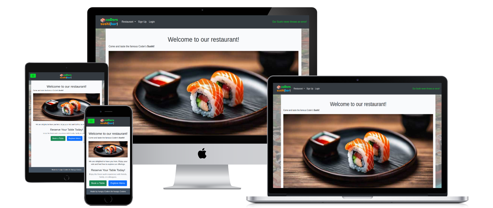 

Coders Sushi Bar is a full-stack Django web application that simulates a modern sushi restaurant experience, combining user-friendly booking functionality, secure authentication, and dynamic content delivery. Built around three modular apps—booking, pages, and users—the system offers a clean, responsive interface powered by Bootstrap, with centralized templates and rich text editing via Summernote. It’s designed for deployment on Heroku, supports cloud development with Gitpod, and integrates optional Google Sheets functionality for data export. Whether you're managing reservations or customizing your profile, Coders Sushi Bar delivers a polished, production-ready platform with a playful touch.

---

## Table of Contents

* [Overview](#overview)
* [Agile Methodology](#agile-methodology)
* [User Experience (UX)](#user-experience-ux)
  * [Strategy / Site Goals](#-strategy--site-goals)
  * [Scope / User Stories](#-scope--user-stories)
  * [Structure / Design Choices](#-structure--design-choices)
  * [Skeleton / Wireframes](#-skeleton--wireframes)
  * [Surface](#-surface)
* [Features](#features)
  * [Existing Features](#-existing-features)
  * [Future Features](#-future-enhancements)
* [Business Model](#-business-model)
* [Screenshots](#screenshots)
* [Database design](#-database-design)
* [Django Apps](#-django-apps-overview)
- Authentication & Authorization
- Product Management
- Cart & Checkout Flow
- Payment Integration
- Order Management
- Media & File Storage
- Session & Security Features
- Technologies Used
- Testing
- Bugs
- Deployment
- Credits
- Acknowledgements

---

## Overview

**Coders Sushi Bar** is a full-stack Django web application built as part of the Code Institute Portfolio Project 4. It simulates a modern sushi restaurant platform, offering users a seamless experience to explore the menu, book tables, and manage their profiles — all within a clean, responsive interface.

The project is structured around three core Django apps:

- **`booking`**: Handles table reservations, including form submissions, availability logic, and user-specific booking views.
- **`pages`**: Manages static and semi-static content such as the homepage, about page, and menu, providing the public-facing identity of the restaurant.
- **`users`**: Manages user authentication, registration, profile editing, and personalized member areas.

The application is designed with modularity and maintainability in mind. All templates are centralized under a shared `/templates` directory, with subfolders for each app and a unified `base.html` layout that includes navigation, footer, and content blocks. The interface is styled using Bootstrap 5 and enhanced with custom CSS and JavaScript, while rich text editing is supported via Summernote.

Coders Sushi Bar is deployed on Heroku and configured for cloud development via Gitpod. It uses environment variables for secure settings, integrates Google Sheets via `gspread` for optional data export, and supports full password reset flows out of the box.

Whether you're a hungry coder or a curious diner, this project serves up a polished, production-ready experience — with no errors, just sushi.

[Back To Top](#table-of-contents)

---

## Agile Methodology

Coders Sushi Bar was developed using a structured Agile approach, emphasizing iterative delivery, stakeholder alignment, and continuous improvement. The project was divided into five weekly milestones, each functioning as a sprint with clearly defined deliverables and review checkpoints. Development was guided by a comprehensive set of user stories and grouped into strategic **epics**, ensuring that every feature served a real user need and contributed to the overall system architecture.

<details>
<summary>Screenshots of Kanban Board, Milestones and project board view</summary>

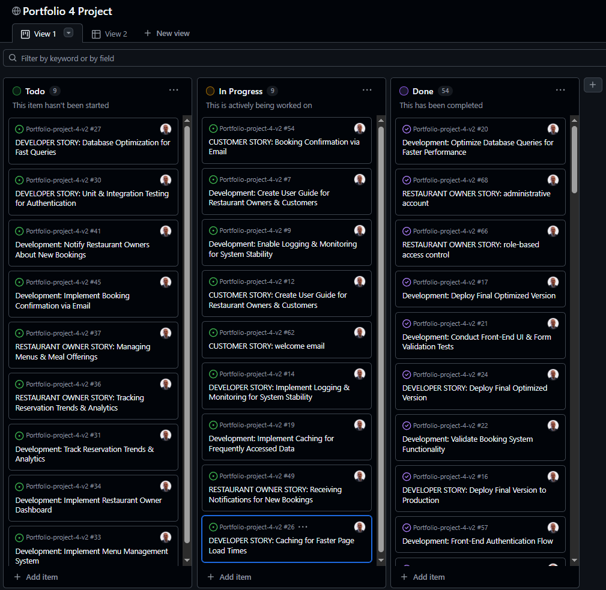

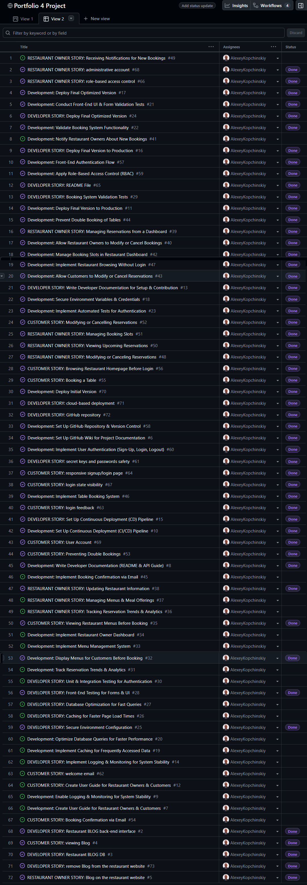

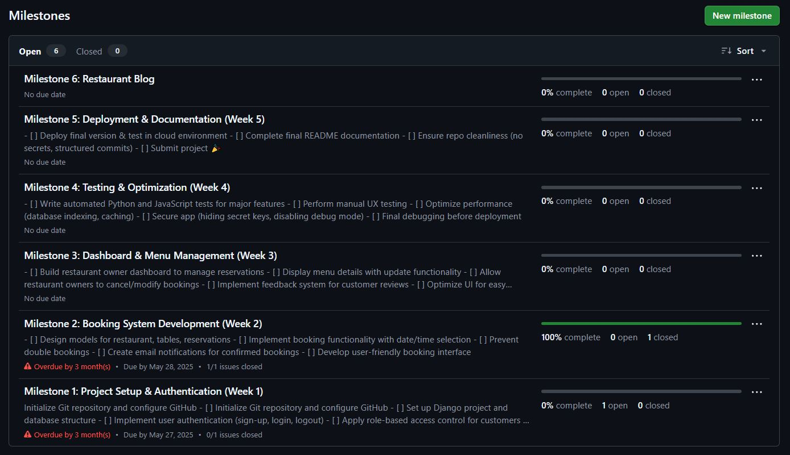

</details>

### 📆 Milestone Breakdown

**Milestone 1: Project Setup & Authentication (Week 1)**
- Initialize Git repository and configure GitHub
- Set up Django project and database structure
- Implement user authentication (sign-up, login, logout)
- Apply role-based access control for customers & restaurant owners
- Deploy basic version for testing

**Milestone 2: Booking System Development (Week 2)**
- Design models for restaurant, tables, reservations
- Implement booking functionality with date/time selection
- Prevent double bookings
- Create email notifications for confirmed bookings
- Develop user-friendly booking interface

**Milestone 3: Dashboard & Menu Management (Week 3)**
- Build restaurant owner dashboard to manage reservations
- Display menu details with update functionality
- Allow restaurant owners to cancel/modify bookings
- Implement feedback system for customer reviews
- Optimize UI for easy navigation

**Milestone 4: Testing & Optimization (Week 4)**
- Write automated Python and JavaScript tests for major features
- Perform manual UX testing
- Optimize performance (database indexing, caching)
- Secure app (hiding secret keys, disabling debug mode)
- Final debugging before deployment

**Milestone 5: Deployment & Documentation (Week 5)**
- Deploy final version & test in cloud environment
- Complete final README documentation
- Ensure repo cleanliness (no secrets, structured commits)
- Submit project 🎉

### 🧩 Epic Overview

| Epic | Focus |
|------|-------|
| **Back-End** | Django architecture, models, views, and database logic |
| **Blog** | Optional restaurant blog interface and content management |
| **Booking System** | Reservation flow, availability checks, and email confirmations |
| **Version Control & Documentation** | GitHub setup, commit hygiene, README and Wiki |
| **User Authentication & Role-Based** | Secure login, sign-up, and access control |
| **User Feedback & Assistance** | Reviews, help guides, and onboarding flows |
| **Database Optimization** | Query tuning, indexing, and performance improvements |
| **Deployment & Security** | Heroku deployment, environment variables, and HTTPS |
| **Testing & Validation** | Unit tests, integration tests, and manual UX reviews |
| **Dashboard** | Admin interface for managing bookings and menus |
| **Front-End** | Responsive design, navigation, and user experience |
| **Monitoring** | Logging, error tracking, and system stability tools |

### 🎯 MoSCoW Prioritization

To ensure delivery of a minimum viable product (MVP) while allowing room for enhancement, features were prioritized using the **MoSCoW method**:

- **Must-Have**: User authentication, booking system, dashboard access, email confirmations, secure deployment
- **Should-Have**: Menu management, role-based access control, customer feedback, automated testing
- **Could-Have**: Blog interface, analytics dashboard, Google Sheets integration, monitoring tools
- **Won’t-Have (for now)**: Real-time availability updates, multi-language support, payment integration

This Agile framework enabled Coders Sushi Bar to evolve from concept to cloud-deployed reality with clarity, velocity, and resilience. Each sprint delivered tangible value, and every epic was aligned with user stories that reflected real-world needs — from hungry customers to busy restaurant owners to meticulous developers.

[Back To Top](#table-of-contents)

---

## User Experience (UX)

Coders Sushi Bar was designed with a user-first mindset, balancing intuitive navigation, responsive design, and functional clarity. The UX strategy was informed by Agile planning, detailed user stories, and a modular architecture that supports both customer-facing and administrative workflows.

---

### 🎯 Strategy / Site Goals

The primary goal was to create a seamless digital experience for a fictional sushi restaurant, enabling users to:
- Browse the restaurant’s offerings without logging in
- Book tables with real-time availability and receive confirmation
- Manage their accounts and reservations
- Provide restaurant owners with a dashboard to oversee bookings, menus, and customer feedback

Secondary goals included:
- Ensuring mobile responsiveness across all devices
- Supporting secure authentication and role-based access
- Delivering a polished, production-ready deployment with clear documentation

---

### 📋 Scope / User Stories

User stories were categorized by persona and prioritized using the MoSCoW method:

#### Must-Have
- Customers can sign up, log in, and book tables
- Restaurant owners can view, modify, and cancel reservations
- Email confirmations for bookings
- Secure authentication and role-based access control

#### Should-Have
- Menu management for restaurant owners
- Customer feedback system
- Responsive design and mobile-friendly navigation
- Automated testing and performance optimization

#### Could-Have
- Blog interface for restaurant updates
- Google Sheets integration for analytics
- Monitoring and logging tools

User stories were grouped into strategic **epics**:
- **Booking System**
- **User Authentication & Role-Based Access**
- **Dashboard**
- **Front-End**
- **Deployment & Security**
- **Testing & Validation**
- **Version Control & Documentation**
- **Monitoring**
- **Database Optimization**
- **User Feedback & Assistance**
- **Blog**
- **Back-End**

---

### 🧱 Structure / Design Choices

The site architecture reflects a clean separation of concerns:
- Three core Django apps: `booking`, `pages`, and `users`
- Centralized template directory with modular subfolders
- A shared `base.html` layout with dynamic navigation and content blocks
- Responsive design powered by Bootstrap 5 and custom CSS
- Summernote integration for rich text editing in admin views

Navigation adapts based on authentication state, offering personalized greetings and member-only access. Dropdown menus are hover-enabled for desktop users and toggle-friendly on mobile.

---

### 📐 Skeleton / Wireframes

Initial wireframes were sketched to define:
- Homepage layout with hero image and call-to-action
- Booking form with calendar and time slots
- Member dashboard with reservation overview
- Profile page with editable user details
- Admin dashboard for restaurant owners

These wireframes informed the HTML structure and guided the CSS layout grid, ensuring consistency across breakpoints.

---

### 🎨 Surface

The visual layer emphasizes clarity, warmth, and brand identity:
- Background image: a giant sushi set with overlay, fixed and center-aligned
- Color palette: deep gray, vibrant green accents, and soft whites
- Typography: Roboto for modern readability
- Interactive elements: hover effects, transitions, and dropdowns
- Mobile-first adjustments: stacked tables, scrollable containers, and adaptive navbar

The result is a polished, intuitive interface that feels welcoming to customers and empowering to restaurant owners — all while maintaining technical elegance and deployment resilience.

*🎨 Main Color Palette*

| Purpose                        | Color Code     | Description                          |
|-------------------------------|----------------|--------------------------------------|
| Background overlay (fallback) | `#F9FAFC`      | Soft off-white for clean contrast    |
| Primary background override   | `darkgray`     | Neutral fallback tone                |
| Navbar background             | `#343a40`      | Dark slate for header/nav            |
| Navbar text & links           | `#ffffff`      | White for high contrast              |
| Navbar hover & accent         | `#08e02c`      | Vibrant green for interactive cues   |
| Footer background             | `#445261`      | Deep blue-gray for footer & dropdown |
| Image background (cards)      | `#188181`      | Teal accent for image containers     |
| Dropdown hover (optional)     | `blueviolet`   | Highlight color for menu items       |

This palette balances clarity, contrast, and brand personality — with vibrant green accents and deep neutrals supporting a sushi-inspired aesthetic. Let me know if you'd like a visual swatch or accessibility contrast check.

[Back To Top](#table-of-contents)

---

## Features

Coders Sushi Bar offers a full-stack, production-ready experience for both customers and restaurant owners. The platform is designed to be intuitive, secure, and scalable, with modular functionality and responsive design at its core. Below is the list of currently implemented features followed by the list of potential future improvements & enchantments.

### ✅ Existing Features

| Feature | Description |
|--------|-------------|
| **User Authentication** | Secure sign-up, login, logout, and password reset flows using Django’s built-in auth system. |
| **Role-Based Access Control (RBAC)** | Differentiated access for customers and restaurant owners, enabling tailored dashboards and permissions. |
| **Table Booking System** | Customers can select date and time, view availability, and receive email confirmations for reservations. |
| **Booking Management Dashboard** | Restaurant owners can view, modify, or cancel bookings from a centralized interface. |
| **Menu Display & Editing** | Customers can browse the restaurant’s menu; owners can update offerings via a rich text editor (Summernote). |
| **Responsive Design** | Mobile-first layout with adaptive navigation, scrollable tables, and optimized typography across devices. |
| **Email Notifications** | Automated confirmation emails for bookings and welcome messages for new users. |
| **Secure Deployment** | Environment variables, debug mode disabled, and static file handling via WhiteNoise for Heroku deployment. |
| **Centralized Templates** | All HTML templates organized under `/templates`, with modular subfolders and a shared `base.html`. |
| **Custom Styling** | Clean, sushi-inspired aesthetic using Bootstrap 5 and custom CSS with media queries for all screen sizes. |
| **User Feedback System** | Customers can leave reviews and comments (optional feature, integrated via dashboard). |
| **Developer Documentation** | README, milestone tracking, and GitHub Wiki support for setup, contribution, and testing. |

### 🚀 Future Enhancements

| Planned Feature | Purpose |
|----------------|---------|
| **Restaurant Blog Interface** | Allow owners to post updates, specials, and stories to engage customers. |
| **Reservation Analytics Dashboard** | Visualize booking trends, peak hours, and customer behavior. |
| **Google Sheets Integration** | Export bookings and feedback to Google Sheets for external analysis. |
| **Real-Time Availability Updates** | Dynamic table availability without page reloads (AJAX or WebSockets). |
| **Multi-Language Support** | Enable localization for broader accessibility. |
| **Payment Integration** | Allow customers to pre-pay or hold reservations with deposits. |
| **Monitoring & Logging Tools** | Add system health tracking and error reporting for long-term stability. |
| **Accessibility Enhancements** | Improve ARIA roles, keyboard navigation, and screen reader support. |
| **Restaurant Profile Customization** | Let owners personalize branding, images, and contact info. |
| **Customer Loyalty Features** | Track repeat visits, offer discounts, and gamify engagement. |

This feature set reflects a balance between MVP delivery and long-term scalability. Every existing feature was built with modularity and user value in mind, while future enhancements aim to deepen engagement, improve performance, and expand functionality across user roles.

[Back To Top](#table-of-contents)

---

## 💼 Business Model

Coders Sushi Bar simulates a digital-first restaurant experience, designed to streamline operations, enhance customer engagement, and support scalable growth. While built as a portfolio project, the platform reflects real-world business logic and could be adapted for commercial deployment.

### 🧩 Core Value Proposition

- **For Customers**: A seamless, mobile-friendly interface to browse menus, book tables, and manage reservations — with instant feedback and email confirmations.
- **For Restaurant Owners**: A centralized dashboard to oversee bookings, update menus, and analyze reservation trends — reducing manual overhead and improving service efficiency.

### 🧮 Revenue Streams (Hypothetical)

| Stream | Description |
|--------|-------------|
| **Subscription Model** | Monthly fee for restaurant owners to access dashboard, analytics, and customization tools. |
| **Premium Features** | Add-ons like SMS notifications, branded email templates, or advanced analytics. |
| **Booking Fees** | Small service fee per confirmed reservation (optional, customer-side or owner-side). |
| **Advertising & Promotions** | Featured placement for restaurants or seasonal menu highlights. |
| **Data Insights** | Aggregated, anonymized analytics for industry benchmarking (opt-in only). |

### 🛠 Operational Model

| Role | Capabilities |
|------|--------------|
| **Customer** | Browse, book, modify/cancel reservations, manage account, leave feedback. |
| **Restaurant Owner** | View and manage bookings, edit menus, access dashboard analytics, customize restaurant profile. |
| **Administrator** | Oversee platform health, manage user roles, moderate content, and maintain security. |

### 📈 Scalability Potential

The platform is designed with modular Django apps, centralized templates, and cloud deployment via Heroku — making it easy to onboard multiple restaurants, expand to new regions, or integrate third-party services (e.g., payment gateways, delivery APIs).

### 🧪 MVP vs. Commercial Expansion

| Tier | Features |
|------|----------|
| **MVP (Portfolio)** | Authentication, booking system, dashboard, menu editing, email confirmations. |
| **Commercial** | Multi-restaurant support, payment integration, loyalty programs, real-time availability, mobile app. |

Coders Sushi Bar demonstrates how thoughtful UX, robust architecture, and Agile development can support a viable business model — whether for a single restaurant or a scalable SaaS platform serving the hospitality industry.

[Back To Top](#table-of-contents)

---

## Screenshots

<details>
<summary>Below are screenshots of the main pages of the project. For each page a mobile screenshot is given as well.</summary>

### Homepage — Hero image, navigation, call-to-action

**Start page**

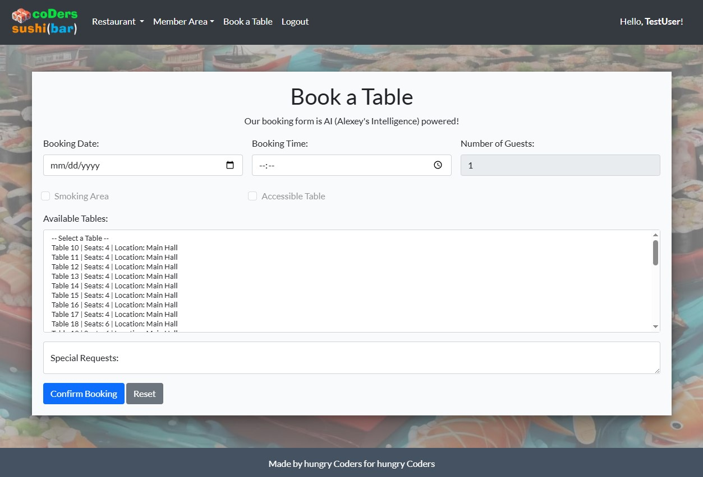

**Start page mobile**

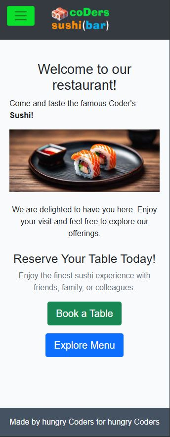

### Booking Page — Date/time selector, form layout

**Booking page**


**Booking page mobile**

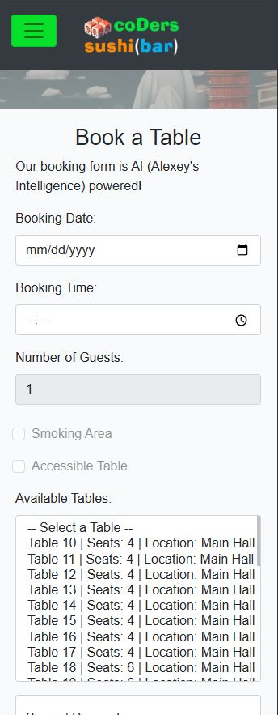

### Menu Page — Menu items, styling, responsiveness

**Menu page**

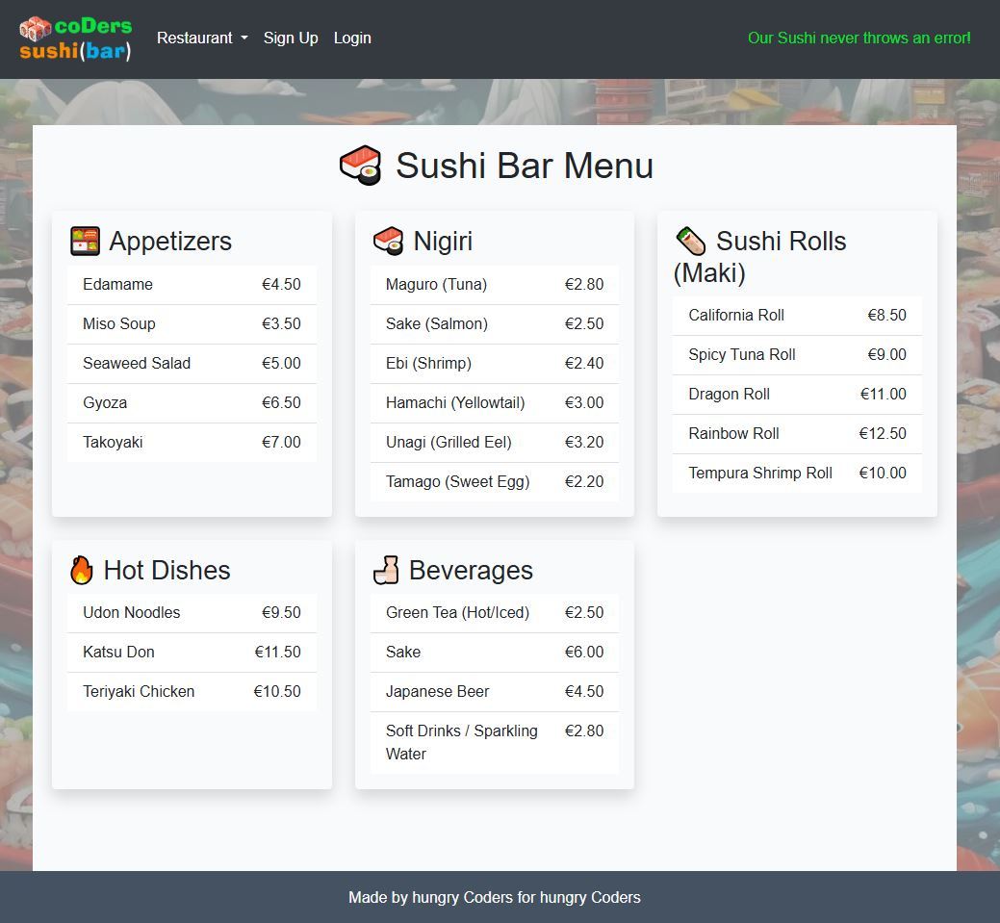

**Menu page mobile**

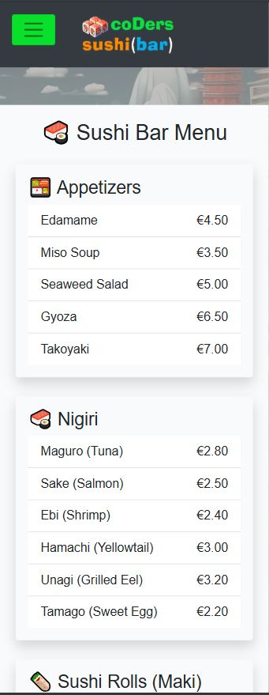

### Login/Signup — Auth flow and feedback messages

**Login page**

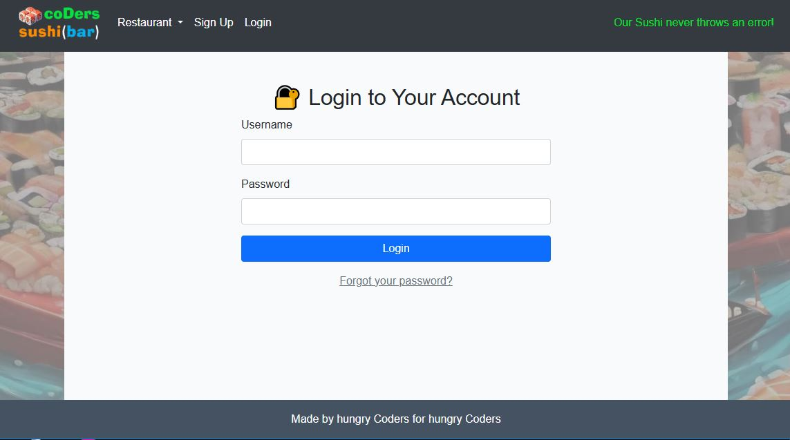

**Login page mobile**

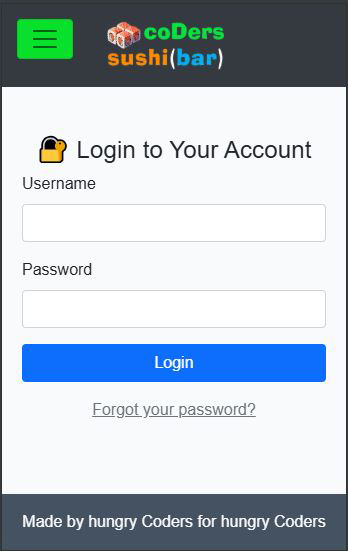

**Logout page**

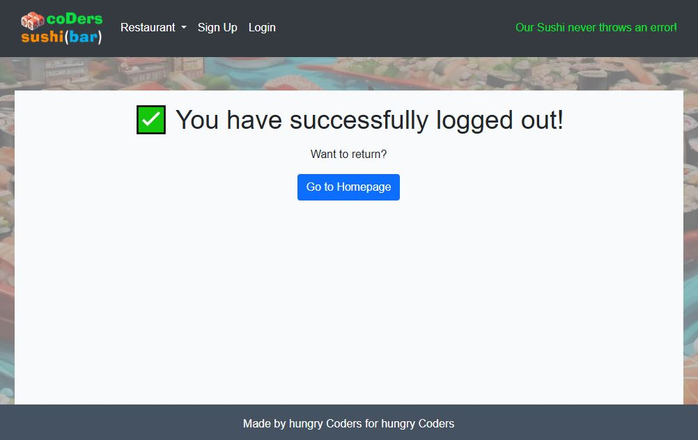

**Logout page mobile**

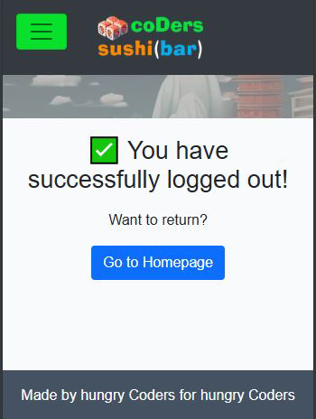

**Sign up page**

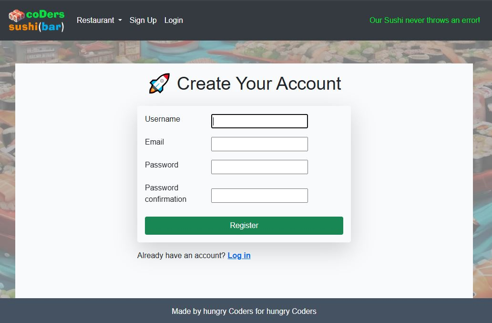

**Sign up page mobile**

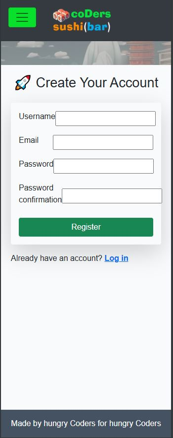

### Member Dashboard — Reservation overview, profile links

**Member page**

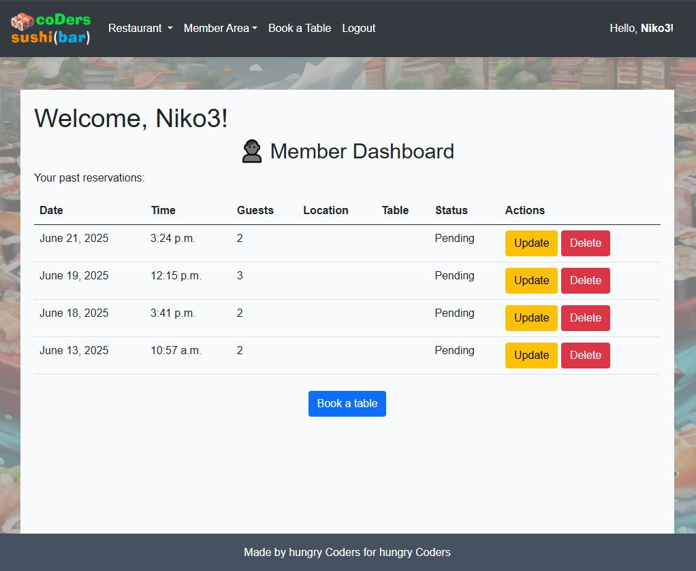

**Member page mobile**

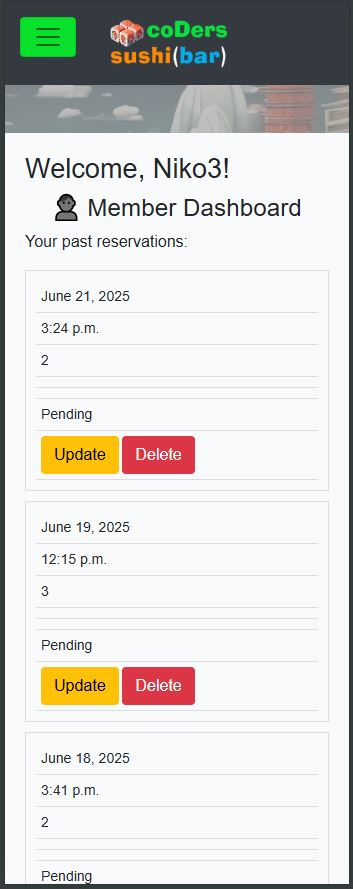

### Restaurant Owner Dashboard — Booking management, menu editing

As Restaurant Owner by definition has admin to Django admin, his admin board is looking like this:

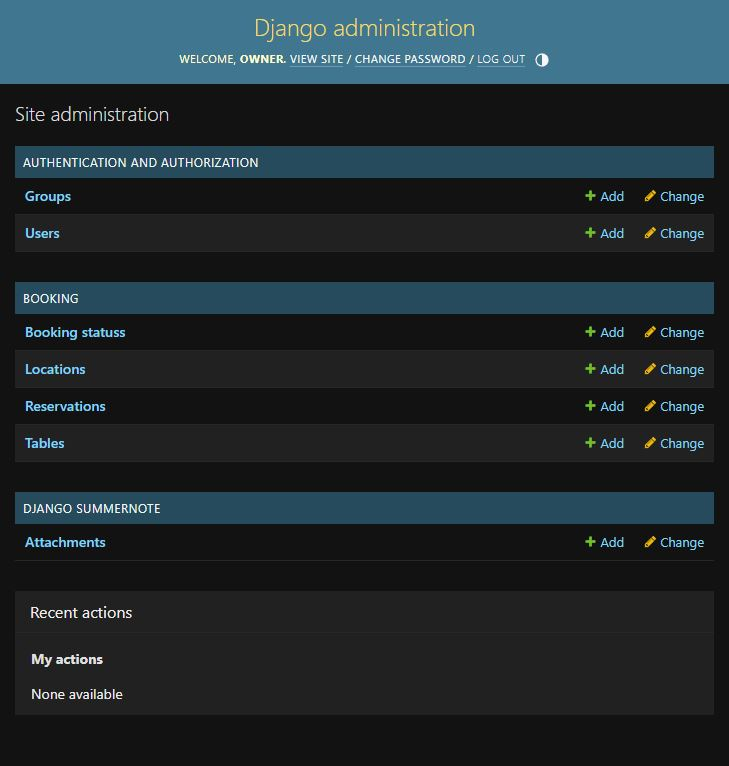

</details>

[Back To Top](#table-of-contents)

---

## 🗄️ Database Design

**Coders Sushi Bar** uses a relational database powered by Django’s ORM, structured to reflect real-world restaurant operations. The schema is modular, normalized, and designed for scalability, with clear relationships between users, tables, locations, and reservations.

### 🧩 Core Models & Relationships

| Model            | Description                                                                 | Relationships |
|------------------|-----------------------------------------------------------------------------|---------------|
| **User**         | Built-in Django user model for authentication and role-based access         | One-to-many with `Reservation` |
| **Table**        | Represents individual tables with attributes like size, smoking, accessible | ForeignKey to `Location`; One-to-many with 
| **Reservation**  | Captures booking details: user, table, date/time, status, and special requests | ForeignKey to `User`, `Table`, `Location`, and `BookingStatus` |
| **BookingStatus**| Represents the status of a reservation (e.g., Pending, Confirmed, Cancelled)| One-to-many with `Reservation` |
| **Location**     | Defines seating zones (e.g., Patio, Main Hall, VIP Room)                    | One-to-many with `Table` and `Reservation` |
`Reservation` |

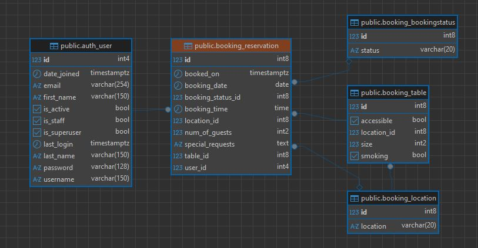

### 🔗 Relationship Diagram (Textual)

- **User ↔ Reservation**: A user can make multiple reservations; each reservation belongs to one user.
- **Table ↔ Reservation**: Each reservation is linked to a specific table to prevent double-booking.
- **Location ↔ Table**: Tables are grouped by seating area (e.g., Main Hall, Terrace etc.).
- **Location ↔ Reservation**: Reservations optionally reference a location for analytics or filtering.
- **BookingStatus ↔ Reservation**: Each reservation has a status (Pending, Confirmed, Cancelled), allowing for workflow control.

---

### 🧠 Design Considerations

- **Normalization**: Reusable entities like `Location` and `BookingStatus` prevent duplication and support filtering.
- **Extensibility**: Easily supports future features like multi-restaurant support, analytics, or dynamic availability.
- **Performance**: Indexed fields like `booking_date`, `booking_time`, and `booked_on` support fast queries and sorting.
- **Security**: Reservations are tied to authenticated users; access control is enforced via Django views and templates.
- **Business Logic Alignment**: Reflects how real restaurants manage seating zones, table attributes, and booking workflows.

---

### 📈 Real-World Mapping

This schema mirrors operational needs:
- Customers book specific tables in defined locations.
- Restaurant owners can filter bookings by status, date, or seating area.
- Special requests and guest count are stored for service preparation.
- Booking status enables confirmation workflows and cancellation tracking.

[Back To Top](#table-of-contents)

---


Absolutely — here’s the updated **Apps Overview** section for your `README.md`, now explicitly noting that the **users and user roles** are based on Django’s built-in models:

---

## 🧩 Django Apps Overview

Coders Sushi Bar is structured as a modular Django project, composed of three dedicated apps: `booking`, `pages`, and `users`. This separation of concerns ensures maintainability, scalability, and clarity across both front-end and back-end development.

### 🗓️ `booking` App

Handles all reservation-related functionality, including table management, booking workflows, and seating logic.

**Key Features:**
- Models for `Reservation`, `Table`, `Location`, and `BookingStatus`
- Prevents double bookings via table/date/time constraints
- Supports seating zones (e.g., patio, indoor) and table attributes (smoking, accessible)
- Includes special requests, guest count, and booking status tracking
- Reservation ordering by creation timestamp (`booked_on`)
- Admin-friendly model string representations for clarity

**User Roles:**
- **Customers**: Can create, view, and cancel their reservations
- **Restaurant Owners**: Can view, modify, and manage all bookings

### 📄 `pages` App

Manages static and semi-static content that defines the public-facing identity of the restaurant.

**Key Features:**
- Homepage, About, and Menu views
- Centralized templates with shared `base.html` layout
- Summernote integration for rich text editing (e.g., menu descriptions)
- Responsive design powered by Bootstrap and custom CSS
- Optional blog interface for restaurant updates (future enhancement)

**User Roles:**
- **All Visitors**: Can browse content without logging in
- **Restaurant Owners**: Can edit menu content and manage blog posts

### 👤 `users` App

Handles authentication, profile management, and role-based access control. This app is built on Django’s robust built-in `User` model, extended with custom logic to differentiate between customer and restaurant owner roles.

**Key Features:**
- Secure sign-up, login, logout, and password reset flows
- Role differentiation using Django’s built-in user groups or flags
- Profile editing and account management
- Personalized dashboard access based on user type
- Welcome email and login feedback messages
- Seamless integration with Django’s authentication system

**User Roles:**
- **Customers**: Can manage their account and bookings
- **Restaurant Owners**: Gain access to admin tools and dashboards

This modular app architecture ensures that each domain—content, booking, and authentication—is cleanly separated, making the codebase easier to navigate, test, and extend.


[Back To Top](#table-of-contents)

---


OLD STUFF
--------------------------------------------------------------------------------

## 📘 Models

**BookingStatus**
Represents the current state of a reservation (e.g., Pending, Confirmed, Cancelled).
| Field | Type | Description | 
| status | CharField | Unique name for the status | 


**Location**
Defines different seating areas in the restaurant, such as “Terrace” or “Window Booth”.
| Field | Type | Description | 
| location | CharField | Name of the area | 


**Table**
Each table is a reservable unit, assigned to a Location. Tables are annotated with features for better matching.
| Field | Type | Description | 
| size | SmallInteger | Number of seats | 
| smoking | Boolean | Whether smoking is allowed | 
| accessible | Boolean | If the table accommodates accessibility needs | 
| location | ForeignKey | Linked to Location | 


**Reservation**
Captures each booking made by a user, including time, table, guest count, and preferences.
| Field | Type | Description | 
| table | ForeignKey | Reserved table (Table) | 
| location | ForeignKey | Optional—can mirror table.location or be filtered | 
| user | ForeignKey | The user placing the booking (User) | 
| booking_date | DateField | Date of the reservation | 
| booking_time | TimeField | Time of the reservation | 
| num_of_guests | PositiveSmallInteger | Guest count | 
| booking_status | ForeignKey | Reservation status (BookingStatus) | 
| special_requests | TextField | Freeform requests (Summernote-enabled) | 
| booked_on | DateTimeField | Auto-generated timestamp when reservation is made | 


**Ordering**: Reservations are sorted newest-first via Meta.ordering = ["-booked_on"].

### 🧑‍💻 Access Control
- Users can only view and manage their own reservations.
- Staff and admins can see and edit all bookings via the Django Admin panel.
- Each reservation is linked to a user and referentially aware of its table and seating area.

## 🗂️ Entity-Relationship Overview


🧠 Legend
- PK: Primary Key
- →: Foreign Key reference
- Arrows (↑) show relationships (e.g., Reservation → Table → Location)

### Admin backen available for the restaurant owner

**Back-end user manager**


**Back-end reservation list**


**Back-end reservation editor**


## 🛡️ Security Measures
- **Encrypted passwords** using Django’s authentication system.  
- **CSRF protection** for all forms.  
- **User roles and permissions** to restrict access to sensitive data.

## 🧪 Testing

### 🔄 Manual Testing
**Perform functional testing by following these steps:**
- User Authentication: Test login, logout, and registration flows.
- Booking Process: Make, update, and cancel a reservation.
- Admin Panel: Verify access control and reservation management.

### ✅ Steps to Validate Django Templates Using W3C Validator
- 1️⃣ Open your browser's Developer Tools (F12 → Elements tab).
- 2️⃣ Find the rendered HTML of the Django page.
- 3️⃣ Right-click → "View Page Source" or "Inspect" → Copy the full HTML.
- 4️⃣ Go to W3C Validator.
- 5️⃣ Choose "Validate by Direct Input" and paste the copied HTML.
- 6️⃣ Click "Check" and review the errors/warnings.
- 7️⃣ Fix any structural issues in your Django templates ( folder).
- ✔ Validates dynamic HTML instead of raw Django template tags.
- ✔ Helps detect missing closing tags, incorrect attributes, and accessibility issues.

### Validating with JSHint

**No erros found by JSHint:**


**W3 validation results for the start page**


**W3 validation results for the booking page**


## 🔍 Code Quality & Linting

### 📝 PEP8 Validation with Code Institute Linter
**To ensure your Python code follows best practices:**
- 1️⃣ Go to [Code Institute Linter](https://pep8ci.herokuapp.com/).  
- 2️⃣ Paste your Python code into the input field.  
- 3️⃣ Click **"Check Code"** to identify formatting issues.  
- 4️⃣ Apply suggested fixes for improved readability and maintainability.

#### C.I. Linter validation results:

**C.I. validation results for the booking views**


**C.I. validation results for the booking urls**


### 

### ✅ Additional Linting Tools
**For automated checks, use:**

```bash
pip install flake8
flake8 your_project/
```

### 🐛 Debugging & Error Handling
- Check logs: tail -f logs/error.log
- Use Django’s debug mode: DEBUG=True in settings.py
- Inspect database queries: python manage.py shell

## 🛠️ Installation
Follow these steps to set up the project locally:

### bash
- git clone https://github.com/your-repo.git
- cd your-repo
- pip install -r requirements.txt
- python manage.py migrate
- python manage.py runserver

## 🎯 Usage
- Sign up/Login to access your booking dashboard.
- Create a reservation with your preferred date and time.
- Manage bookings via the member page.
- Admin users can oversee all reservations.

### 📌 Technologies Used
- Django (backend framework)
- SQLite/PostgreSQL (database)
- Bootstrap (frontend styling)
- Python (core programming language)
- CSS
- JavaScript
- HTML

### 🤝 Contributing
We welcome contributions! To contribute:
- Fork the repository.
- Create a new branch (git checkout -b feature-branch).
- Commit changes (git commit -m "Added new feature").
- Push to GitHub and create a pull request.

## Known Bugs
There are no known bugs.

### 📄 License
This project is licensed under the MIT License.

### 📢 Contact
For questions or support, reach out at kopchinskiy@gmail.com.
